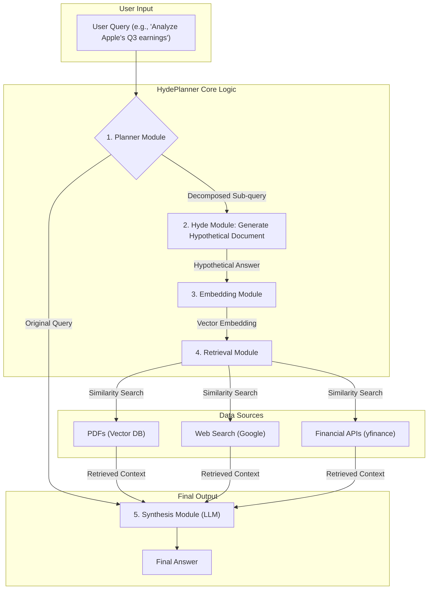

### 다이어그램 설명

이 다이어그램은 `HydePlanner`의 전체적인 아키텍처 흐름을 보여줍니다.

1.  **User Query**: 사용자가 복잡한 질문을 입력합니다.
2.  **Planner Module**: 질문을 분석하고, 필요하다면 하위 질문으로 분해하여 검색 전략을 수립합니다.
3.  **Hyde Module**: 분해된 질문에 대한 '가상적인 완벽한 답변'을 LLM을 통해 생성합니다.
4.  **Embedding & Retrieval**: 생성된 가상 문서를 벡터로 변환(Embedding)한 뒤, 이 벡터를 사용해 각종 데이터 소스(PDF, 웹, API)에서 가장 관련성 높은 정보를 검색(Retrieval)합니다.
5.  **Synthesis Module**: 검색된 실제 정보(Context)와 원본 질문을 최종 LLM에 전달하여, 사실 기반의 정확하고 종합적인 답변을 생성합니다.
6.  **Final Answer**: 최종적으로 사용자에게 답변이 제공됩니다.
