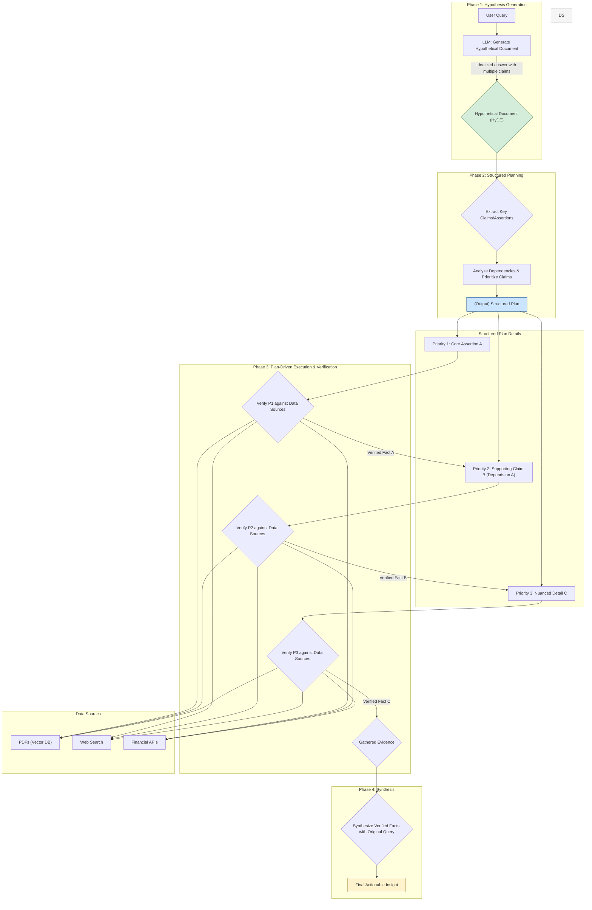

### HyDE-Planner 아키텍처 상세 설명

이 다이어그램은 HyDE-Planner의 4단계 프로세스를 상세히 보여줍니다.

1.  **Phase 1: Hypothesis Generation (가설 생성)**
    *   사용자의 복잡한 질문을 받아 LLM을 통해 이상적인 답변, 즉 **가설 문서(Hypothetical Document)**를 생성합니다. 이 문서는 검증해야 할 여러 주장(Claim)을 포함하는 "목표 청사진" 역할을 합니다.

2.  **Phase 2: Structured Planning (구조화된 계획 수립)**
    *   가설 문서에서 핵심 주장들을 추출합니다.
    *   단순히 목록을 만드는 것을 넘어, 주장 간의 **논리적 의존 관계**("A를 알아야 B를 검증할 수 있다")와 **중요도**를 분석하여 **구조화된 계획(Structured Plan)**을 생성합니다. 이 계획에는 각 단계를 검증할 우선순위가 명시됩니다.

3.  **Phase 3: Plan-Driven Execution & Verification (계획 기반 실행 및 검증)**
    *   수립된 계획에 따라, 가장 높은 우선순위의 주장부터 순차적으로 검증을 시작합니다.
    *   각 주장을 검증하기 위해 필요한 데이터 소스(PDF, 웹 검색, API 등)에 접근하여 관련 정보를 수집합니다. 이전 단계에서 검증된 사실은 다음 단계의 검증에 활용될 수 있습니다.

4.  **Phase 4: Synthesis (종합)**
    *   검증 과정에서 수집된 모든 사실(Verified Facts)과 사용자의 원본 질문을 최종적으로 LLM에 제공합니다.
    *   이를 통해 단순 정보 요약을 넘어, 검증된 사실에 기반한 깊이 있는 **실행 가능한 인사이트(Actionable Insight)**를 생성하여 사용자에게 전달합니다.