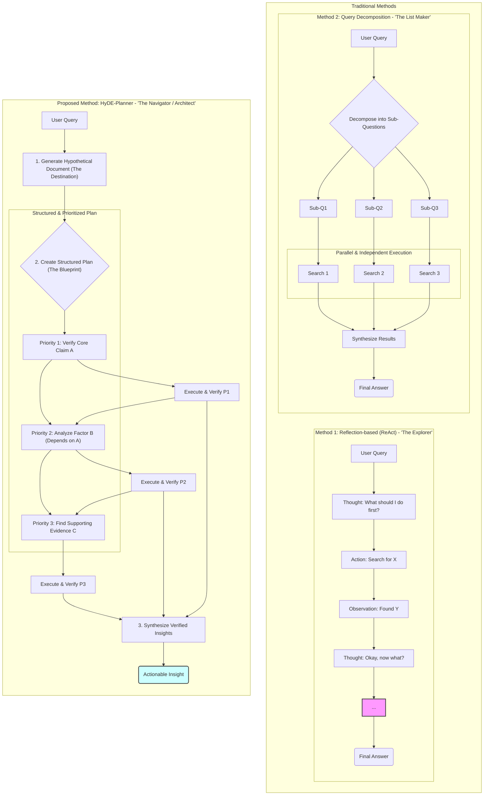

### 다이어그램 설명

이 다이어그램은 세 가지 방법론의 핵심적인 차이를 시각적으로 보여줍니다.

1.  **ReAct (탐험가):** `Thought -> Action -> Observation`의 순환적인 구조로 표현하여, 명확한 목표 없이 계속해서 다음 단계를 탐색하는 모습을 보여줍니다. 이는 사용자가 설명한 "어디로 가야 할까?"를 계속 고민하는 탐험가와 같습니다.

2.  **Query Decomposition (리스트 메이커):** 하나의 질문을 여러 개의 독립적인 하위 질문으로 나누고, 이를 병렬적으로 처리하는 모습을 보여줍니다. 각 질문 간의 관계나 우선순위가 없는 단순 '분해'의 특징을 나타냅니다.

3.  **HyDE-Planner (네비게이터/설계자):**
    *   **가설 문서 생성 (목적지 설정):** 가장 먼저 최종 목표의 청사진을 그립니다.
    *   **구조화된 계획 (청사진):** 단순히 질문을 나누는 것을 넘어, **우선순위**와 **의존 관계**(A를 알아야 B를 검증)를 가진 구조적인 계획을 수립합니다.
    *   **체계적인 실행:** 계획에 따라 순차적이고 체계적으로 검증을 수행하여 최종적으로 '실행 가능한 인사이트'를 도출합니다. 이는 방황을 최소화하는 네비게이터이자, 구조를 설계하는 설계자의 모습과 일치합니다.